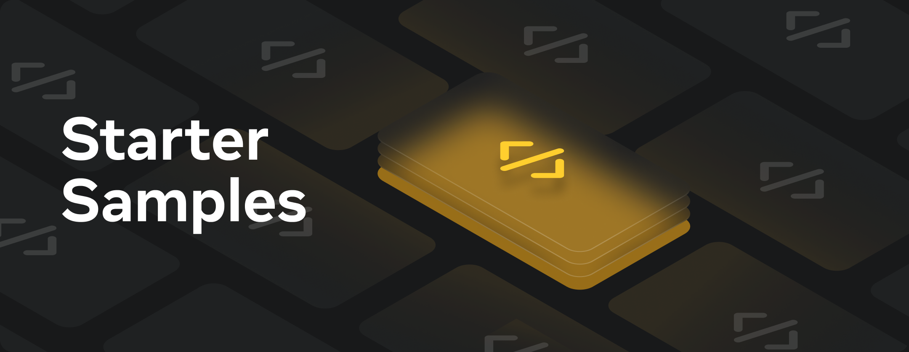
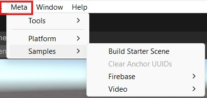

# Unity Starter Samples
The starter samples you will find here are to help you navigate and understand our APIs with more flexibility. We encourage you to look into them, test them out and inspire yourself on how the APIs can be used in your own project.

The [Oculus License](./LICENSE) applies to the samples.

This project was built using the [Unity engine](https://unity.com/download).

## Getting The Code
Clone this repo using the "Code" button above, or this command:
```sh
git clone https://github.com/oculus-samples/Unity-StarterSamples.git
```

## How to run the project in Unity
1. Make sure you're using  *Unity 2022.3.15f1* or newer.
2. In the Project window, navigate to [Assets/StarterSamples/Usage](Assets/StarterSamples/Usage).
3. Click on individual scenes.
4. Click **Play** button to explore scene functionality in Unity.

## How to test on device
1. Navigate to **Meta** > **Samples** > **Build Starter Scene** to build an APK that will launch the **Starter Scene**.
    <div style="margin-left: 4.5em;"></div>
    * In this apk you will be able to cycle through the different sample scenes to test them out on device.
2. Navigate to the `Unity-StarterSamples` folder and copy the `StartScene.apk` to your device using [Meta Quest Developer Hub](https://developer.oculus.com/documentation/unity/ts-mqdh-deploy-build/).

## SDK Dependencies
All Meta SDKs can be found in the [Unity Asset Store](https://assetstore.unity.com/publishers/25353).
This project depends on SDKs defined in the [Packages/manifest.json](./Packages/manifest.json):
* [Meta XR Core SDK](https://assetstore.unity.com/packages/tools/integration/meta-xr-core-sdk-269169)

## Integrate Samples to your own project
1. Make sure your project uses the same SDK version
2. Move the samples to your project
   <details>
      <summary><b>Copy Samples directory</b></summary>

      + Copy [Assets/StarterSamples](./Assets/StarterSamples) directory to your own project
    </details>
    <details>
      <summary><b>Create UnityPackage and Import it</b></summary>

      1. Open Unity-StarterSamples project in Unity
      2. Right-click on [Assets/StarterSamples](./Assets/StarterSamples) and select <i>Export Package...</i>
      3. Save package in an easy location to retrieve
      4. Open your own project (where you want the samples to be added)
      5. Click on <i>Assets->Import Package->Custom Package...</i> from the menu bar
      6. Find the package we saved in step 3 and click <i>Open</i>
    </details>
